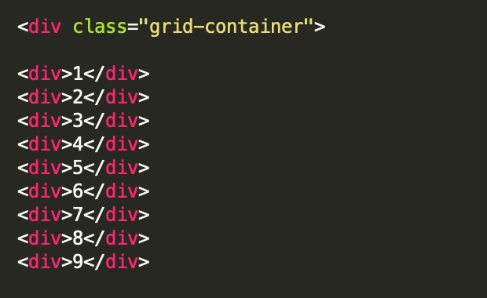

# PROCRASTINATION BATTLEBOARD 


## MAKE YOUR OWN BATTLEBOARD

This is a really simple template you can use to create your own personalized feeds taking advantage of iframe, twitter embed and a couple other features. 


## STEPS

1. Make a new directory(folder) and copy over **template.html** . *Rename file as you see fit*
2. Open up template in browser, it should look like the following : 
  

  
3. Now edit the **template.html** file and you will notice a section like below: 
  


4. Each number in the Div relates to the number you saw in step 2 when you opened it in the browser. Simply replace the number in the div with whatever item you wish to embed. Examples below: 

### TWITTER  PANNEL

- COPY THE CODE BELOW INTO A SELECTED DIV 
- REPLACE THE TWO XXXXX VALUES WITH TWITTER HANDLE i.e. elonmusk
- YOU CAN CHANGE THE SIZES (data-width & data-height) AS YOU SEE FIT. 

```
 <div><a class="twitter-timeline" href="https://twitter.com/XXXXX?ref_src=twsrc%5Etfw" data-width="300"
  data-height="400">Tweets by XXXXX </a> <script async src="https://platform.twitter.com/widgets.js" charset="utf-8"></script></div>
```

### IFRAME  PANNEL   

- PUT ANY URL IN THE **src=** SECTION  

```  <div><iframe width="90%" height="100%" src="https://XXXX.com" frameborder="0"></iframe></div> ```

### YOUTUBE  PANNEL 

- ONE PER PAGE (OR IT WONT WORK)
- PUT CHANNEL ID IN **cid** SECTION

```
 <div><script src="https://ajax.googleapis.com/ajax/libs/jquery/2.1.1/jquery.min.js"></script>
<iframe class="latestVideoEmbed" vnum='0' cid="UCWN3xxRkmTPmbKwht9FuE5A" width="90%" height="100%" frameborder="0" allowfullscreen></iframe>         
</div>
```

## STILL STRUGGLING? 

Have a look at the existing files `index.html` or `second.html` to get an idea of how the code is imbedded. 

## NOTES

The javascript at the bottom is strictly for the youtube video, it could be modified to allow two videos per page. You can change a value from 0 to 1, if you wish the video to autoplay. 

Pagination is used in mines.

Any issues contact me via my twitter handle @McMurchie 

Cheers 