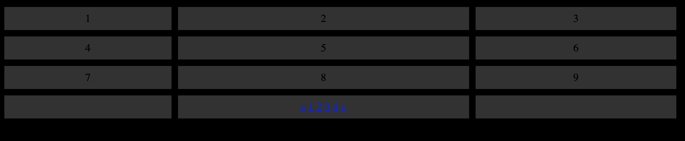

# PROCRASTINATION BATTLEBOARD 


## MAKE YOUR OWN BATTLEBOARD

This is a really simple template you can use to create your own personalized feeds taking advantage of iframe, twitter embed and a couple other features. 


## STEPS

1. Make a new directory(folder) and copy template.html into it *rename file as you see fit*
2. Open up template in browser, it should look like the following : 
  

  
3. Now edit the template.html file and you will notice a section like below: 
  


4. Each number in the Div relates to the number you saw in part 2 when you opened it in the browser. Simply replace the number in the div with whatever item you wish to embed. Examples below: 

### TWITTER  PANNEL

- COPY THE CODE BELOW INTO A SELECTED DIV 
- REPLACE THE TWO XXXXX VALUES WITH TWITTER HANDLE i.e. elonmusk

 ```
 <div><a class="twitter-timeline" href="https://twitter.com/XXXXX?ref_src=twsrc%5Etfw" data-width="300"
  data-height="400">Tweets by XXXXX </a> <script async src="https://platform.twitter.com/widgets.js" charset="utf-8"></script></div>
```